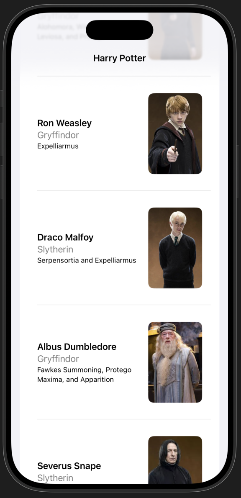
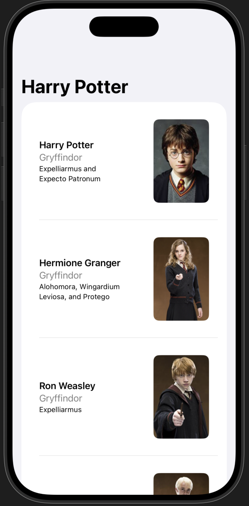

# 🧙‍♂️ Harry Potter SwiftUI Demo

A small SwiftUI demo project built to learn the fundamentals of **Swift**, **SwiftUI**, and **basic app architecture** on iOS.

The app displays a list of Harry Potter characters loaded from a local JSON file, using a simple MVVM-style structure with a repository layer.

---

## 📸 Screenshots

  
  

---

## 📱 Features

- SwiftUI `List` displaying character cards
- Local JSON data loading
- DTO → Domain model mapping
- Simple ViewModel (`@Observable`)
- Preview-friendly mock data
- Clean and readable SwiftUI layout

---

## 🧱 Architecture

The project follows a **light MVVM + Repository** approach
